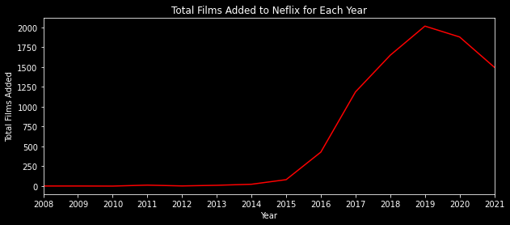
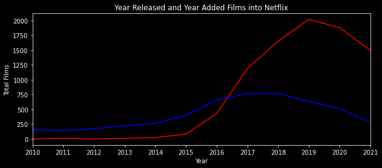
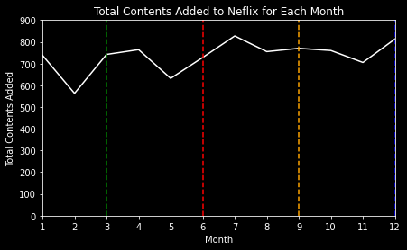
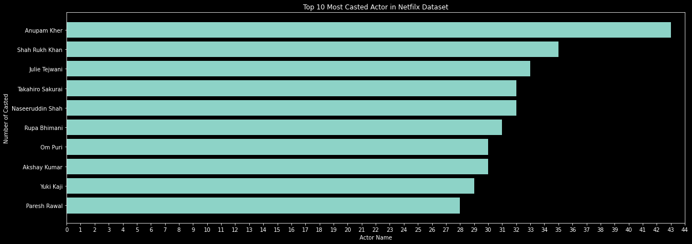

# Introduction
Here, we will try to explore [this dataset](https://www.kaggle.com/datasets/shivamb/netflix-shows?resource=download). This is just a basic data exploration.  
 

# Objectives
It is a Netflix dataset from Kaggle. 
We will try to answer the following questions:
1. What is the most popular relase year for films on Netflix?
2. What year did Netflix add the most content to its platform?
3. What is the most popular month to add new content?
4. What is the longest title of a film within the dataset?
5. Which actor shows up the most frequent in the dataset?
 

# Walkthrough
Please navigate to `main.ipynb` for the walkthrough of each problem. I tried to provide two or more methods to solve each problem. Please let me know if you have a better approach. I'll be open to new things.

## Summary
### **Problem 1**

 
As the chart shows, we have many films that were released in 2017 and 2018. The chart shows only the year where a particular film is released, not the year it was added to Netflix. 
Another interesting point is, even though I only include films that were released in 2010 above, we know that from 2018, the amount of films from 2019 to 2021 is not as significant as films released in 2017 and 2018. In a nutshell, it is declining.
   
 

### **Problem 2**

 
From the chart, we can conclude that 2019 is the year where Netflix added films the most to its platform. Then, we can see starts from 2015, Netflix started to robustly add more and more films up to 2019 and it started to decline afterward.
 
 

***If we plot the two charts, it looks like this***:
 

 
 

### **Problem 3**

 
From the chart, we can see there are some up and downs where Netflix added content to its platform. So, I tried to plot where every season started (based on the US). For instance, summer starts around June, autumn starts around September, winter around December, and spring around March. Each season is represented by red, orange, blue, and green dash lines respectively.
 
 
We can see Netflix added content to its platform the most around summer and winter, for obvious reasons. I think this is a reasonable hypothesis to make considering how robust people would consume Netflix during these two periods.   
 
 

### **Problem 4**
| No | Title | Title Length |
|---|:---:|:---:|
| 1 | Jim & Andy: The Great Beyond - Featuring a Very Special, Contractually Obligated Mention of Tony Clifton | 104 |
| 2 | The Power of Grayskull: The Definitive History of He-Man and the Masters of the Universe | 88 |
| 2 | Mike Birbiglia: What I Should Have Said Was Nothing: Tales from My Secret Public Journal | 88 |
| 4 | Steve Martin and Martin Short: An Evening You Will Forget for the Rest of Your Life | 83 |
| 5 | Cultivating the Seas: History and Future of the Full-Cycle Cultured Kindai Tuna | 79 |

 

> To be honest, there's not much to explain this. But if you're curious, searching what these films are about may be interesting. 

 

### **Problem 5**

 

Seeing actors from India appears the most in the chart is not surprising considering how many films India produces anually each year. To me, the interesting part here is that two voice actors from Japan *Takahiro Sakurai* and *Yuki Kaji* made it into the list.

