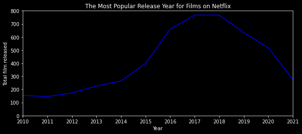

# Introduction
Here, we will try to explore [this dataset](https://www.kaggle.com/datasets/shivamb/netflix-shows?resource=download). This is just a basic data exploration.  
 

# Objectives
It is a Netflix dataset from Kaggle. 
We will try to answer the following questions:
1. What is the most popular relase year for films on Netflix?
2. What year Netflix added the most content to its platform?
3. What is the most popular month to add new content?
4. What is the longest title of film within the dataset?
5. Which actor shows up the most frequent in the dataset?
 

# Walkthrough
Please navigate to `main.ipynb` for the walkthrough to each probelms. I tried to provide two or more methods to solve each problems. Please let me know if you have better approach. I'll be open to that.

## Summary
### Problem 1

